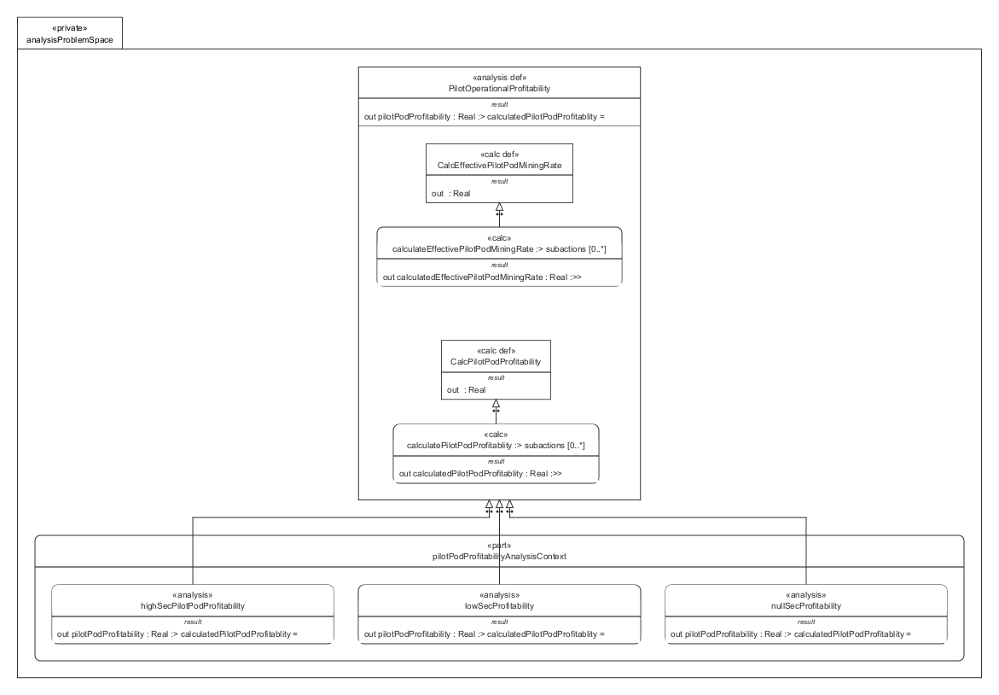

# AnalysisProblemSpace.sysml

## Overview

This SysMLv2 model defines analytical constructs for evaluating pilot profitability in mining operations. It uses `analysis def`, `calc def`, `part`, and `analysis` elements to formalize calculations and scenario-specific analyses within the operational domain.

## Description

### Analysis Definition

- **analysis def PilotOperationalProfitability**
  - Subject: `Domain` (the operational domain context).
  - **objective**: Documents the purpose—evaluating pilot profitability considering ore value, buyout price, and mining efficiency.
  - **Inputs**:
    - `pilotPodMiningRate`: Technical mining rate (m³/hour).
    - `oreMarketRetailValue`: Average market buy price (ISK/m³).
    - `buybackPercentage`: Instant buyback percentage of market price.
    - `asteroidMiningEfficiency`: Mining efficiency in asteroid belts.
    - `boost`: Command ship boost percentage.
    - `logisticsEfficency`: Logistics support efficiency.
  - **Return**: `pilotPodProfitability` (calculated ISK/hour).

- **calc def CalcEffectivePilotPodMiningRate**
  - Inputs: `pilotPodMiningRate`, `boost`, `logisticsEfficency`, `asteroidMiningEfficiency`.
  - Returns: Effective mining rate, calculated as the product of all inputs.

- **calc def CalcPilotPodProfitability**
  - Inputs: `effectivePilotPodMiningRate`, `buybackPercentage`, `oreMarketRetailValue`.
  - Returns: Pilot profitability (ISK/hour), calculated as the product of all inputs.

### Scenario-Specific Analysis Context

- **part pilotPodProfitabilityAnalysisContext**
  - Contains three scenario-specific analyses using `analysis` elements:
    - **highSecPilotPodProfitability**: Applies `PilotOperationalProfitability` to high security mining pilots.
    - **lowSecProfitability**: Applies `PilotOperationalProfitability` to low security mining pilots.
    - **nullSecProfitability**: Applies `PilotOperationalProfitability` to null security mining pilots.
  - Each analysis binds the subject to the relevant pilot pod and provides scenario-specific input values from the domain model.

## SysMLv2 Compliance

- Uses `analysis def` for formal analytical constructs.
- Uses `calc def` for reusable calculation logic.
- Uses `part` and `analysis` for scenario instantiation and context binding.
- Inputs and returns are explicitly typed and connected to domain properties.

## Purpose

This file provides a structured SysMLv2 specification for analyzing pilot profitability across different operational scenarios, supporting decision-making, requirements validation, and system optimization.

## License

This repository is for educational and modeling purposes. See the repository license for details.