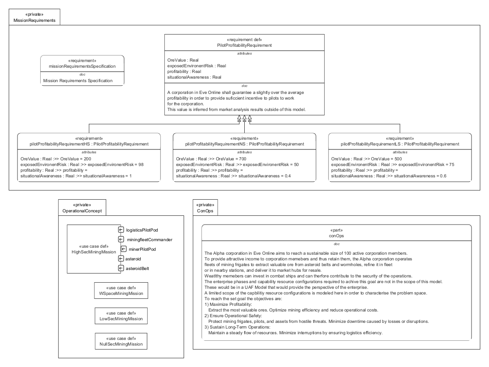

# ConOps_OpsCon.sysml

## Overview

`ConOps_OpsCon.sysml` models the **concept of operations**, **mission requirements**, and **operational concepts** for an Eve Online mining corporation. This SysML file provides a structured approach to defining goals, requirements, and workflows for mining operations in different security environments.

## Description

### Concept of Operations
- The Alpha corporation aims to reach 100 active members by providing attractive income through mining operations.
- Fleets of mining frigates extract ore, refine it, and deliver it to market hubs.
- Security is managed by members with combat ships.
- The model focuses on maximizing profitability, ensuring safety, and sustaining long-term operations.

### Mission Requirements
- Requirements are defined for mining in High Sec, Low Sec, and Null Sec zones.
- Each requirement specifies:
  - Minimum profitability (ISK/hour)
  - Situational awareness
  - Environmental risk
  - Ore value
- Requirements are linked to stakeholder concerns and operational contexts.

### Operational Concept
- Use cases describe mining missions in different security zones.
- The `HighSecMiningMission` use case details:
  - Roles: miner pilots, fleet commander, logistics pilots, asteroid belt/asteroids.
  - Events and actions: warping, mining, threat detection, defense, logistics, ore delivery.
  - Message exchanges between actors.
- Additional use cases are placeholders for Low Sec, Null Sec, and Wormhole Space missions.

## Usage

Use this model to:
- Analyze and refine operational workflows for mining fleets.
- Define and validate mission requirements for profitability and safety.
- Support system integration and interface definition for mining operations.
- Serve as a reference for further SysML modeling and enterprise architecture.

## Related Files

- [`LogicalMiningFrigateGrayBox.sysml`](MiningFrigate/LogicalMiningFrigateGrayBox.sysml): Defines the logical architecture of the mining frigate.

## License

This repository is for educational and modeling purposes. See the repository license for details.