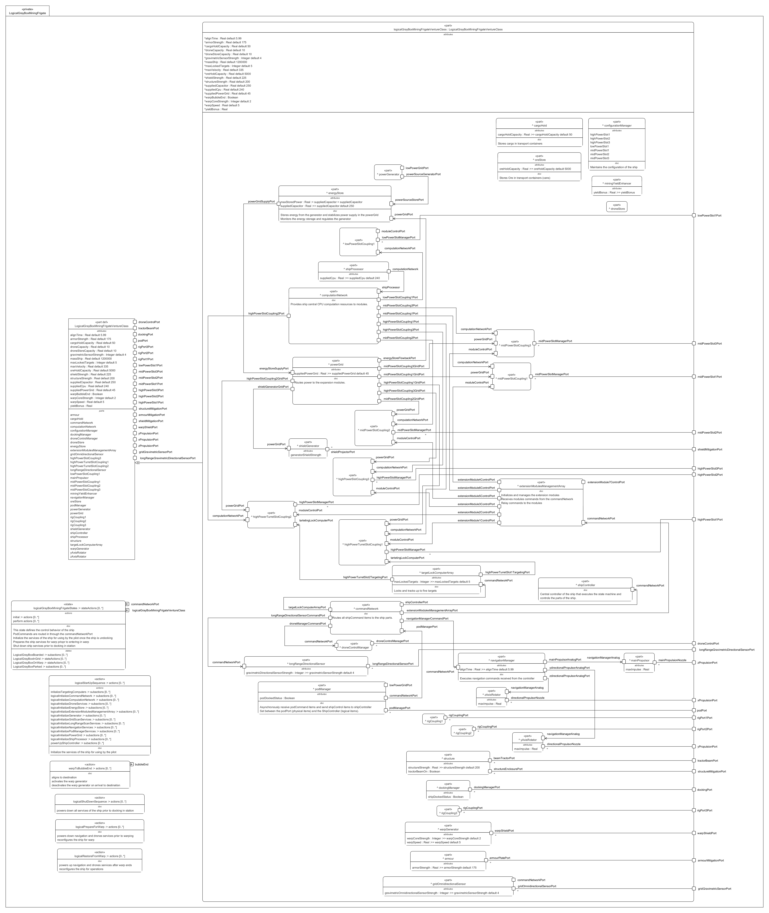

# LogicalMiningFrigateGrayBox.sysml

## Overview

`LogicalMiningFrigateGrayBox.sysml` defines the **logical architecture** for a mining frigate (Venture Class) in the context of an Eve Online corporation's mining operations. This SysML model provides a detailed blueprint for the internal structure, subsystem interactions, resource management, and operational behaviors of the mining frigate.

## Description

The model is organized in the `LogicalGrayBoxMiningFrigate` package and includes:

- **Imports**: References to ship specifications, scalar values, SI units, parameters, COTS modules, logical definitions, and standard ports/interfaces.
- **Main Logical Part**:  
  - `logicalGrayBoxMiningFrigateVentureClass` inherits from the black-box specification and redefines/extends logical attributes and ports.
- **Attributes**:  
  - Defines physical and operational properties such as mass, power, CPU, velocity, strengths, and capacities.
- **Ports**:  
  - Represents connection points for power, control, sensors, propulsion, docking, and other ship functions.  
  - Port naming follows conventions indicating slot type, function, and direction (e.g., `highPowerSlot1Port`, `droneControlPort`, `warpShieldPort`).
- **Logical Parts**:  
  - Subsystems and managers for slots, sensors, propulsion, energy, command/control, etc.  
  - Each part may have its own ports, attributes, and behaviors.
- **Bindings**:  
  - Connects logical parts to the main system ports, establishing internal structure.
- **Interfaces and Connectors**:  
  - Defines how parts communicate (control, power, computation, analog signals) using interface blocks and connectors.
- **State Machine**:  
  - Describes ship operational states (parked, boarded, in grid, on warp) and transitions based on events and conditions.
- **Actions/Behaviors**:  
  - Defines startup, shutdown, warp preparation, and restoration sequences, detailing how the ship initializes and manages its services.

## Purpose

This file models the **logical decomposition** of a mining frigate, specifying how its subsystems interact, how resources are managed, and how operational behaviors are orchestrated. It supports system integration, control, and resource flow within the ship, serving as a foundation for further refinement and implementation.

## Usage

Use this model to:

- Analyze and refine the logical architecture of mining frigates.
- Support system integration and interface definition.
- Simulate operational behaviors and resource flows.
- Serve as a reference for further SysML modeling and implementation.

## Related Files

- [`ConOps_OpsCon.sysml`](../ConOps_OpsCon.sysml): Defines the operational concept, mission requirements, and use cases for mining operations in various security zones.

## License

This repository is for educational and modeling purposes. See the repository license for details.
