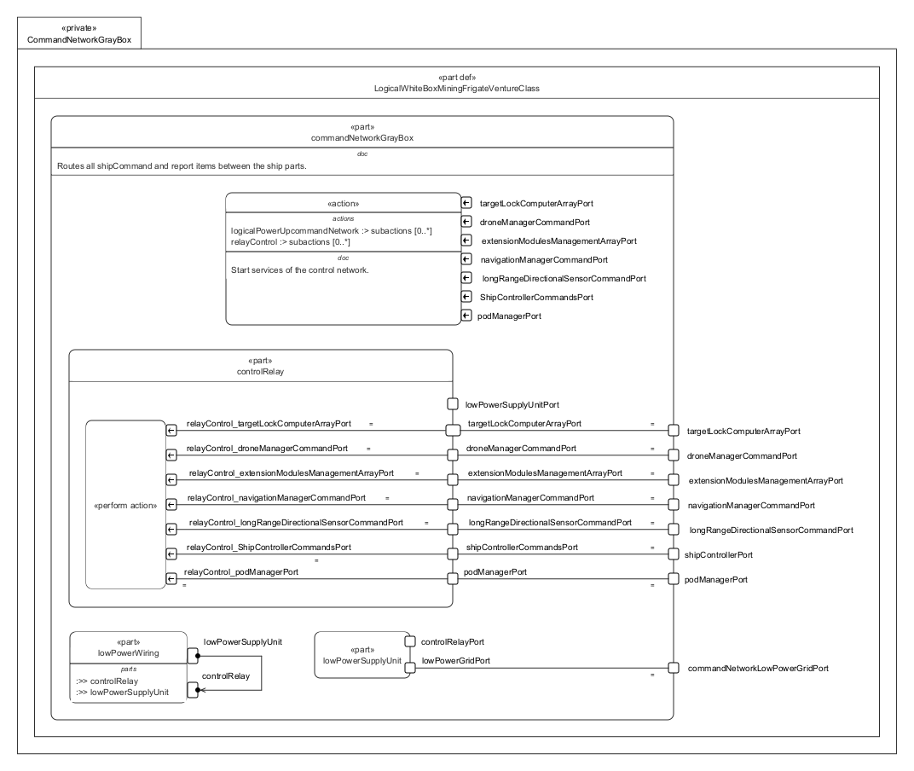

# CommandNetworkGrayBox.sysml

## Overview

This SysMLv2 model specifies the logical structure and behavior of the command network for the Venture-class mining frigate. It uses `part def`, `port`, `action`, `bind`, `interface`, and `perform` elements to model the routing and management of ship commands and reports between ship subsystems.

## Description

### Logical Structure

- **part def LogicalWhiteBoxMiningFrigateVentureClass**
  - Inherits from `LogicalGrayBoxMiningFrigateVentureClass`.
  - Contains the main logical part: `commandNetworkGrayBox`.

- **part commandNetworkGrayBox : LogicalPart :> commandNetwork**
  - Routes all ship commands and reports between ship parts.
  - Defines multiple command and control ports for subsystem managers:
    - `podManagerPort`, `shipControllerPort`, `longRangeDirectionalSensorCommandPort`, `navigationManagerCommandPort`, `extensionModulesManagementArrayPort`, `droneManagerCommandPort`, `targetLockComputerArrayPort`, `commandNetworkLowPowerGridPort`.

- **Subsystem Parts**
  - **lowPowerSupplyUnit**
    - Provides low power grid and control relay ports.
    - Performs initialization action for powering up the command network.
  - **controlRelay**
    - Connects all subsystem command ports.
    - Performs relay control actions, routing commands and reports between pod manager and subsystems.
  - **lowPowerWiring**
    - References `lowPowerSupplyUnit` and `controlRelay`.
    - Implements the `LogicalLowPowerGridIF` interface to connect supplier and consumer ports for low power wiring.

### Bindings and Interfaces

- **bind** statements
  - Bind subsystem ports to corresponding relay ports, ensuring correct routing of commands and reports.
- **interface** definition
  - Specifies the connection between supplier and consumer ports for low power grid wiring.

### Actions and Behavior

- **action logicalInitializeCommandNetwork**
  - Starts the control network services.
  - Sequences: start → power up → relay control.
  - Relays signals from pod manager to all subsystems and returns reports.

## SysMLv2 Compliance

- Uses `part def`, `port`, `action`, `bind`, `interface`, and `perform` for structure and behavior.
- Explicit port typing and binding for traceability.
- Actions and relay logic model dynamic behavior of the command network.

## Purpose

This file provides a structured SysMLv2 specification for the command network of the mining frigate, supporting system integration, control, and operational reliability.

## License

This repository is for educational and modeling purposes. See the repository license for details.