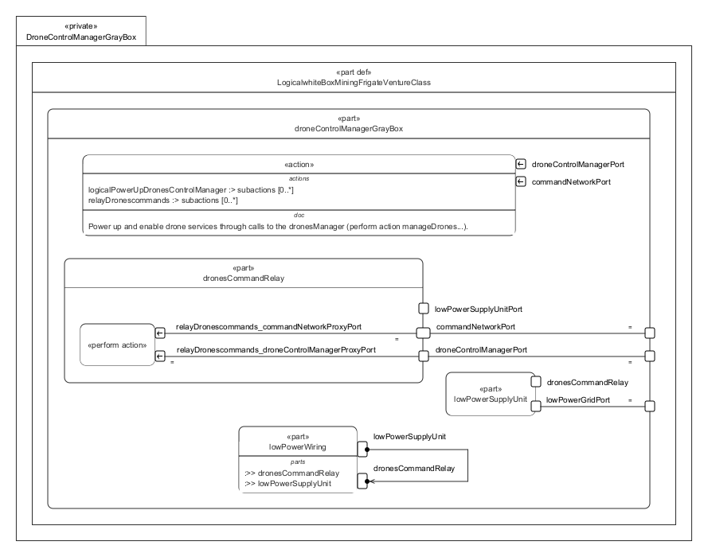

# DroneControlManagerGrayBox.sysml

## Overview

This SysMLv2 model specifies the logical structure and behavior of the drone control manager subsystem for the Venture-class mining frigate. It uses `part def`, `port`, `action`, `bind`, `interface`, and `perform` elements to model the routing, initialization, and management of drone commands and power supply.

## Description

### Logical Structure

- **part def LogicalwhiteBoxMiningFrigateVentureClass**
  - Inherits from `LogicalGrayBoxMiningFrigateVentureClass`.
  - Contains the main logical part: `droneControlManagerGrayBox`.

- **part droneControlManagerGrayBox : LogicalPart :> droneControlManager**
  - Manages drone command and control within the ship.
  - Defines ports for:
    - `droneControlManagerPort` (array of drone control ports)
    - `commandNetworkPort` (for logical drone command sub-port)
    - `lowPowerGridPort` (for power supply)

  - **Subsystem Parts**
    - **lowPowerSupplyUnit**
      - Provides low power grid and command relay ports.
      - Performs initialization action to power up the drone control manager.
    - **dronesCommandRelay**
      - Connects command network and drone control manager ports.
      - Relays drone commands between the manager and the network.
      - Performs relay actions for command routing.
    - **lowPowerWiring**
      - References `lowPowerSupplyUnit` and `dronesCommandRelay`.
      - Implements the `LogicalLowPowerGridIF` interface to connect supplier and consumer ports for low power wiring.

  - **Bindings**
    - Binds manager, command network, and power grid ports to corresponding relay and supply unit ports for correct routing and power distribution.

  - **Actions and Behavior**
    - **action logicalInitializeDroneServices**
      - Powers up and enables drone services.
      - Sequences: start → power up drone control manager → relay drone commands.
      - Inputs: drone control manager ports and command network port.

## SysMLv2 Compliance

- Uses `part def`, `port`, `action`, `bind`, `interface`, and `perform` for structure and behavior.
- Explicit port typing and binding for traceability.
- Actions and relay logic model dynamic behavior of the drone control subsystem.

## Purpose

This file provides a structured SysMLv2 specification for the drone control manager of the mining frigate, supporting subsystem integration, command routing, and operational reliability.

## License

This repository is for educational and modeling purposes. See the repository license for details.