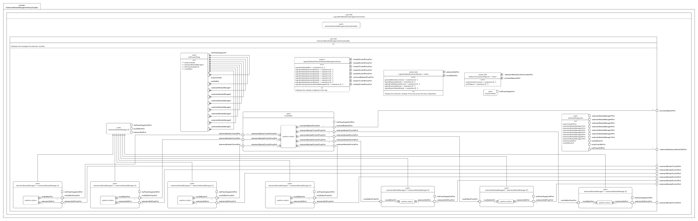

# ExtensionModuleManagementArrayGrayBox.sysml

## Overview

This SysMLv2 model specifies the logical structure and behavior of the extension module management array for the Venture-class mining frigate. It uses `part def`, `port`, `action`, `perform`, `bind`, `interface`, and `abstract part` elements to model the initialization, control, and power distribution for up to seven extension modules.

## Description

### Logical Structure

- **part def LogicalWhiteBoxMiningFrigateVentureClass**
  - Inherits from `LogicalGrayBoxMiningFrigateVentureClass`.
  - Contains the main logical part: `extensionModulesManagementArrayGrayBox`.

- **part def ExtensionModulesManagementArrayGrayBox :> LogicalPart**
  - Manages initialization and control of up to seven extension modules.
  - Defines ports for command network, individual module control, and low power grid distribution.
  - Contains subsystem parts:
    - **arrayController**: Manages initialization and power supply for the array.
    - **lowPowerSupplyUnit**: Distributes low power grid to all module managers and array components.
    - **muxDeMux**: Handles command and report routing between the command network and extension modules.
    - **extensionModuleManager[7]**: Abstract part for managing each extension module, with dedicated control and power ports.
    - **lowPowerWiring**: Connects all components and manages low power grid interfaces.

### Interfaces and Bindings

- **interface LogicalLowPowerGridIF**
  - Connects supplier and consumer ports for low power grid distribution between supply unit, array controller, muxDeMux, and each module manager.

- **interface LogicalControlIF**
  - Connects command and control ports between muxDeMux and each extension module manager.

- **bind statements**
  - Bind command network and module control ports to corresponding subsystem ports for correct routing and power distribution.

### Actions and Behavior

- **action logicalInitializeExtensionModulesManagementArray**
  - Orchestrates the initialization sequence for the entire array, including powering up, initializing muxDeMux, and each extension module manager.
  - Forks actions for parallel initialization of muxDeMux and all module managers.

- **action logicalInitializeDeMux**
  - Powers up muxDeMux and relays commands and reports for each module.

- **action def RelayCommandsAndReports**
  - Accepts, verifies, and relays ship commands and reports between the command network and extension modules.

- **action def LogicalInitializeExtensionModule**
  - Powers up, diagnoses, enables services, and manages command/report exchange for each extension module.

## SysMLv2 Compliance

- Uses `part def`, `port`, `action`, `perform`, `bind`, `interface`, and `abstract part` for structure and behavior.
- Explicit port typing and binding for traceability.
- Parallel and sequential actions model dynamic initialization and control logic.
- Interfaces ensure correct resource and command routing.

## Purpose

This file provides a structured SysMLv2 specification for the extension module management array of the mining frigate, supporting subsystem integration, command routing, and reliable power distribution for all extension modules.

## License

This repository is for educational and modeling purposes. See the repository license for details.