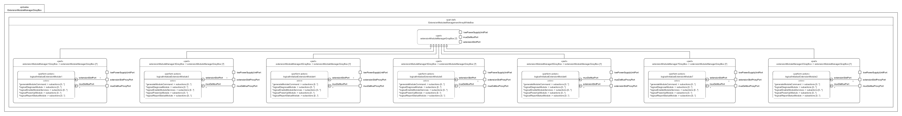

# ExtensionModuleManagerGrayBox.sysml

## Overview

This SysMLv2 model specifies the logical structure and behavior of the extension module manager subsystem for the Venture-class mining frigate. It uses `part def`, `abstract part`, `port`, `action def`, `perform`, and `bind` elements to model the initialization, control, and reporting for up to seven extension modules.

## Description

### Logical Structure

- **part def ExtensionModulesManagementArrayWhiteBox**
  - Inherits from `ExtensionModulesManagementArrayGrayBox`.
  - Contains seven extension module manager parts, each managing a single extension module.

- **abstract part extensionModuleManagerGrayBox[7] : LogicalPart**
  - Each manager defines:
    - **Ports**
      - `extensionSlotPort` (LogicalModuleCommandPort): For direct module control.
      - `muxDeMuxPort` (~LogicalModuleCommandPort): For command multiplexing/demultiplexing.
      - `lowPowerSupplyUnitPort`: For power distribution.
    - **Actions**
      - `LogicalInitializeExtensionModule`: Orchestrates the initialization and control of the module.
        - Powers up the module.
        - Diagnoses module status and receives commands.
        - Enables module services.
        - Accepts and generates module toggle commands.
        - Sends commands and receives module reports.
        - Reports module status to the ship via the muxDeMux port.

- **Concrete Parts**
  - Seven concrete parts (`extensionModuleManager1GrayBox` to `extensionModuleManager7GrayBox`) each bind proxy ports to the abstract manager ports and perform the initialization action with correct port assignments.

### Actions and Behavior

- **LogicalInitializeExtensionModule**
  - Sequence:
    - Start → Power up module → Diagnose module → Enable services → Accept toggle command → Generate and send command → Accept module report → Report status to ship.
    - Conditional logic for handling power-up success or failure.
    - Data flow for module commands and reports.

## SysMLv2 Compliance

- Uses `part def`, `abstract part`, `port`, `action def`, `perform`, and `bind` for structure and behavior.
- Explicit port typing and binding for traceability.
- Actions model dynamic initialization, command handling, and reporting for each extension module.

## Purpose

This file provides a structured SysMLv2 specification for the extension module manager subsystem of the mining frigate, supporting modular subsystem integration, command routing, and reliable status reporting for all extension modules.

## License

This repository is for educational and modeling purposes. See the repository license for details.