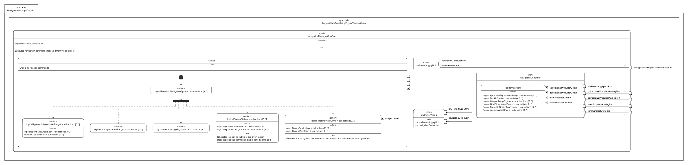

# NavigationManagerGrayBox.sysml

## Overview

This SysMLv2 model specifies the logical structure and behavior of the navigation manager subsystem for the Venture-class mining frigate. It uses `part def`, `port`, `attribute`, `action`, `perform`, `bind`, and `interface` elements to model the execution of navigation commands, power distribution, and subsystem interactions.

## Description

### Logical Structure

- **part def LogicalWhiteBoxMiningFrigateVentureClass**
  - Inherits from `LogicalGrayBoxMiningFrigateVentureClass`.
  - Contains the main logical part: `navigationManagerGrayBox`.

- **part navigationManagerGrayBox : LogicalPart :> navigationManager**
  - Executes navigation commands received from the controller.
  - Defines attributes:
    - `alignTime` (default value: 5.99)
  - Defines ports for:
    - `commandNetworkPort` (command input)
    - `mainPropulsorAnalogPort`, `zdirectionalPropulsorAnalogPort`, `ydirectionalPropulsorAnalogPort` (analog control signals for propulsion)
    - `navigationManagerLowPowerGridPort` (power supply)

  - **Subsystem Parts**
    - **lowPowerSupplyUnit**
      - Provides low power grid and navigation computer ports.
      - Performs power-up actions for navigation system initialization.
    - **navigationComputer**
      - Handles command network and propulsion control ports.
      - Performs navigation service initialization, outputs analog control signals for propulsion.
    - **lowPowerWiring**
      - References `lowPowerSupplyUnit` and `navigationComputer`.
      - Implements the `LogicalLowPowerGridIF` interface to connect supplier and consumer ports for power distribution.

  - **Bindings**
    - Binds command network and propulsion ports between navigation manager and navigation computer.
    - Binds low power grid port to supply unit.

### Actions and Behavior

- **action logicalInitializeNavigationServices**
  - Enables navigation commands and initializes the navigation system.
  - Inputs: command network proxy port.
  - Outputs: analog control signals for main, z-directional, and y-directional propulsors.
  - Sequences:
    - Start → power up navigation system.
    - Forks to parallel actions for approach, orbit, keep at range, docking, and warp drive execution.

- **action logicalApproachSignatureAtRange**
  - Accepts approach command, navigates to signature at specified range, reports status.

- **action logicalOrbitSignatureAtRange**
  - Placeholder for orbiting a signature at range.

- **action logicalKeepAtRangeSignature**
  - Placeholder for keeping at range from a signature.

- **action logicalDockInStation**
  - Accepts docking command, requests docking clearance, reports back to pod, handles docking request acceptance, and reports status.

- **action logicalexecuteWarpDrive**
  - Accepts warp command, reports warp status, performs warp maneuvers, and reports arrival at destination.

## SysMLv2 Compliance

- Uses `part def`, `port`, `attribute`, `action`, `perform`, `bind`, and `interface` for structure and behavior.
- Explicit port typing and binding for traceability.
- Actions model dynamic navigation command execution and reporting.
- Interfaces ensure correct power distribution.

## Purpose

This file provides a structured SysMLv2 specification for the navigation manager subsystem of the mining frigate, supporting subsystem integration, command execution, and reliable navigation operations.

## License

This repository is for educational and modeling purposes. See the repository license for details.