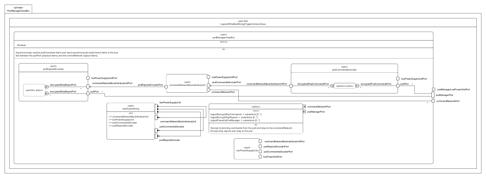

# PodManagerGrayBox.sysml

## Overview

This SysMLv2 model specifies the logical structure and behavior of the pod manager subsystem for the Venture-class mining frigate. It uses `part def`, `port`, `attribute`, `action`, `perform`, `bind`, and `interface` elements to model the asynchronous reception and transmission of pod commands and ship reports, as well as power distribution and command decoding/encoding.

## Description

### Logical Structure

- **part def LogicalWhiteBoxMiningFrigateVentureClass**
  - Inherits from `LogicalGrayBoxMiningFrigateVentureClass`.
  - Contains the main logical part: `podManagerGrayBox`.

- **part podManagerGrayBox : LogicalPart :> podManager**
  - Manages asynchronous reception of pod commands and transmission of ship reports.
  - Sits between the physical pod port and the logical control network.
  - Defines attributes:
    - `podDockedStatus`
  - Defines ports for:
    - `podManagerPort` (~PodPort)
    - `commandNetworkPort` (LogicalShipCommandPort)
    - `podManagerLowPowerGridPort` (lowPowerGridPort)

  - **Subsystem Parts**
    - **commandNetworkBusInterfaceUnit**
      - Handles bus interface for command and report routing.
      - Ports for low power supply, command network, command decoding, and report encoding.
    - **lowPowerSupplyUnit**
      - Distributes low power grid to all subsystem parts.
      - Performs power-up actions for pod manager initialization.
    - **podCommandsDecoder**
      - Decodes encrypted pod commands to logical ship commands.
      - Performs decryption actions.
    - **podReportsEncoder**
      - Encodes decrypted ship reports to encrypted pod reports.
      - Performs encryption actions.
    - **lowPowerWiring**
      - Connects all subsystem parts for power distribution.
      - Implements `LogicalLowPowerGridIF` interface for wiring between supplier and consumer ports.

  - **Bindings and Interfaces**
    - Binds pod, command network, and power grid ports to corresponding subsystem ports.
    - Uses `CommandIF` and `LogicalControlIF` interfaces to connect command and report flows between pod manager, decoder, encoder, and bus interface.

### Actions and Behavior

- **action logicalInitializePodManagerServices**
  - Orchestrates the initialization sequence for the pod manager.
  - Decrypts incoming pod commands and relays them to the command network.
  - Encrypts ship reports and relays them to the pod.
  - Sequences: start → power up → fork to decrypt commands and encrypt reports.

- **action logicalDecryptShipCommands**
  - Decrypts and relays commands from the pilot pod to the ship controller.

- **action logicalEncryptShipReports**
  - Collects, encrypts, and relays ship reports to the pilot pod.

## SysMLv2 Compliance

- Uses `part def`, `port`, `attribute`, `action`, `perform`, `bind`, and `interface` for structure and behavior.
- Explicit port typing and binding for traceability.
- Actions model dynamic command and report processing.
- Interfaces ensure correct wiring and signal routing.

## Purpose

This file provides a structured SysMLv2 specification for the pod manager subsystem of the mining frigate, supporting secure command and report exchange, subsystem integration, and reliable power distribution.

## License

This repository is for educational and modeling purposes. See the repository license for details.