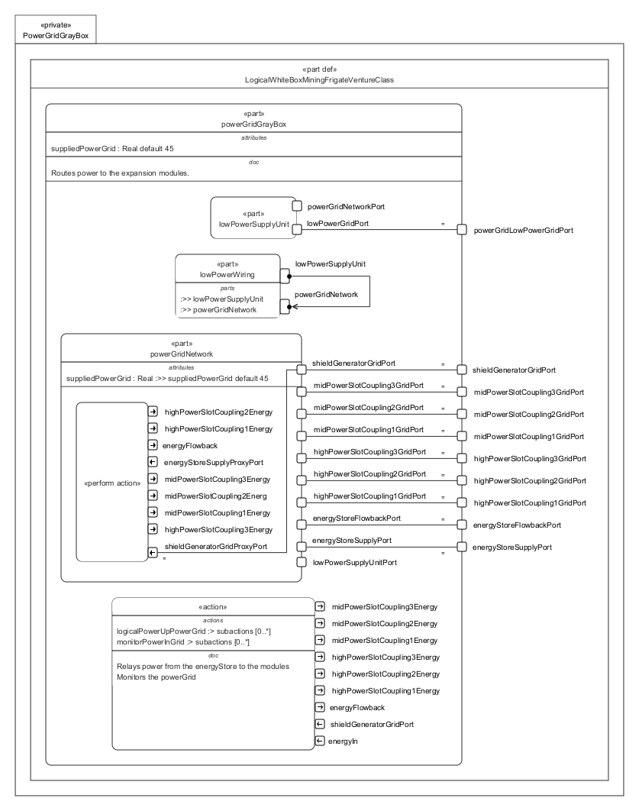

# PowerGridGrayBox.sysml

## Overview

This SysMLv2 model specifies the logical structure and behavior of the power grid subsystem for the Venture-class mining frigate. It uses `part def`, `port`, `attribute`, `action`, `perform`, `bind`, and `interface` elements to model the routing, monitoring, and distribution of power to ship modules and subsystems.

## Description

### Logical Structure

- **part def LogicalWhiteBoxMiningFrigateVentureClass**
  - Inherits from `LogicalGrayBoxMiningFrigateVentureClass`.
  - Contains the main logical part: `powerGridGrayBox`.

- **part powerGridGrayBox : LogicalPart :> powerGrid**
  - Routes and monitors power distribution to expansion modules and subsystems.
  - Defines attributes:
    - `suppliedPowerGrid` (default value: 45)
  - Defines ports for:
    - `energyStoreSupplyPort` (~LogicalPowerGridPort)
    - `energyStoreFlowbackPort`
    - `highPowerSlotCoupling1GridPort`, `highPowerSlotCoupling2GridPort`, `highPowerSlotCoupling3GridPort`
    - `midPowerSlotCoupling1GridPort`, `midPowerSlotCoupling2GridPort`, `midPowerSlotCoupling3GridPort`
    - `shieldGeneratorGridPort`
    - `powerGridLowPowerGridPort` (low power grid distribution)

  - **Subsystem Parts**
    - **lowPowerSupplyUnit**
      - Provides low power grid and network ports.
      - Performs initialization action for powering up the grid.
    - **powerGridNetwork**
      - Mirrors all main power grid ports and attributes.
      - Monitors power input and output for all slots and shield generator.
      - Performs monitoring actions and outputs energy flowback and slot-specific energy values.
    - **lowPowerWiring**
      - References `lowPowerSupplyUnit` and `powerGridNetwork`.
      - Implements the `LogicalLowPowerGridIF` interface to connect supplier and consumer ports for low power wiring.

  - **Bindings**
    - Binds all main power grid ports between `powerGridGrayBox` and `powerGridNetwork` for consistent routing and monitoring.
    - Binds low power grid port to supply unit.

### Actions and Behavior

- **action logicalInitializePowerGrid**
  - Relays power from the energy store to modules and monitors the power grid.
  - Inputs: energy supply, shield generator grid port.
  - Outputs: energy flowback and slot-specific energy values.
  - Sequences:
    - Start → power up grid → monitor power in grid.

- **action logicalPowerUpPowerGrid**
  - Powers up the grid for operation.

- **action monitorPowerInGrid**
  - Monitors energy input, shield generator grid, and outputs energy flowback and slot-specific energy values.

## SysMLv2 Compliance

- Uses `part def`, `port`, `attribute`, `action`, `perform`, `bind`, and `interface` for structure and behavior.
- Explicit port typing and binding for traceability.
- Actions model dynamic power distribution and monitoring.
- Interfaces ensure correct wiring and signal routing.

## Purpose

This file provides a structured SysMLv2 specification for the power grid subsystem of the mining frigate, supporting reliable power distribution, subsystem integration, and operational monitoring.

## License

This repository is for educational and modeling purposes. See the repository license for details.