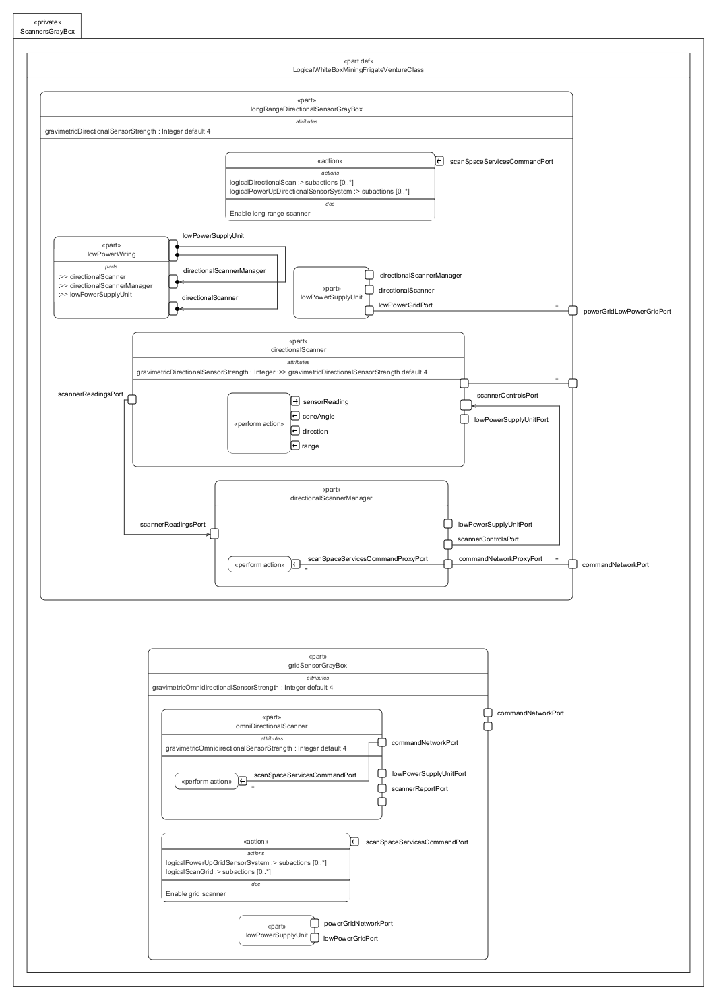

# ScannersGrayBox.sysml

## Overview

This SysMLv2 model specifies the logical structure and behavior of the scanner subsystems for the Venture-class mining frigate. It uses `part def`, `port`, `attribute`, `action`, `perform`, `bind`, and `interface` elements to model the initialization, control, and data flow for ship scanning operations.

## Description

### Defined Parts

- **part def LogicalWhiteBoxMiningFrigateVentureClass**
  - Inherits from `LogicalGrayBoxMiningFrigateVentureClass`.
  - Contains two main logical parts:
    - `longRangeDirectionalSensorGrayBox`
    - `gridSensorGrayBox`

#### longRangeDirectionalSensorGrayBox : LogicalPart :> longRangeDirectionalSensor
  - **Attributes**
    - `gravimetricDirectionalSensorStrength` (default: 4)
  - **Ports**
    - `longRangeDirectionalSensorPort`
    - `commandNetworkPort` (~LogicalShipCommandPort)
    - `powerGridLowPowerGridPort`
  - **Subsystem Parts**
    - **lowPowerSupplyUnit**
      - Ports for low power grid, directional scanner, and directional scanner manager.
      - Performs power-up for the directional sensor system.
    - **directionalScanner**
      - Attributes for sensor strength.
      - Ports for sensor, controls, readings, and power supply.
      - Performs the scan logic, accepting range, direction, and cone angle as inputs, and outputs sensor readings.
    - **directionalScannerManager**
      - Ports for power, command proxy, controls, and readings.
      - Performs scan management, accepting scan commands.
    - **lowPowerWiring**
      - References supply unit, scanner, and manager.
      - Implements `LogicalLowPowerGridIF` for wiring between supplier and consumer ports.
  - **Bindings and Interfaces**
    - Binds sensor, command, and power ports between parts.
    - Interfaces for analog signal and low power grid connections.
  - **Actions**
    - `logicalInitializeLongRangeScanServices` orchestrates enabling, powering up, scanning, and reporting for the long-range directional sensor.

#### gridSensorGrayBox : LogicalPart :> gridOmnidirectionalSensor
  - **Attributes**
    - `gravimetricOmnidirectionalSensorStrength` (default: 4)
  - **Ports**
    - `gridOmnidirectionalSensorPort`
    - `commandNetworkPort` (~LogicalShipCommandPort)
  - **Subsystem Parts**
    - **lowPowerSupplyUnit**
      - Ports for low power grid and power grid network.
      - Performs power-up for the grid sensor system.
    - **omniDirectionalScanner**
      - Attributes for sensor strength.
      - Ports for sensor, command, report, and power supply.
      - Performs grid scan logic, accepting scan commands and outputting scan reports.
  - **Actions**
    - `logicalInitializeGridScanServices` orchestrates enabling, powering up, scanning, and reporting for the grid omnidirectional sensor.

## SysMLv2 Compliance

- Uses `part def`, `port`, `attribute`, `action`, `perform`, `bind`, and `interface` for structure and behavior.
- Explicit definition and wiring of subsystem parts.
- Actions model dynamic scan command execution and data reporting.
- Interfaces ensure correct power and signal routing.

## Purpose

This file provides a structured SysMLv2 specification for the scanner subsystems of the mining frigate, supporting subsystem integration, command execution, and reliable scanning operations.

## License

This repository is for educational and modeling purposes. See the repository license for details.