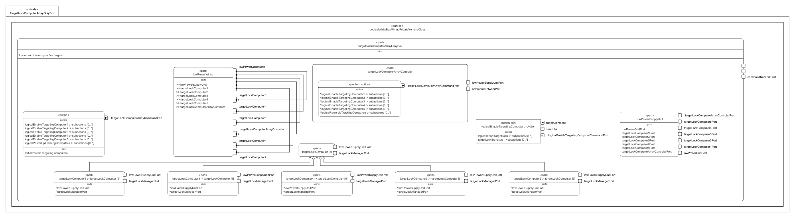

# TargetLockComputerArrayGrayBox.sysml

## Overview

This SysMLv2 model specifies the logical structure and behavior of the target lock computer array subsystem for the Venture-class mining frigate. It uses `part def`, `port`, `attribute`, `action`, `perform`, `bind`, `interface`, and `abstract part` elements to model the initialization, control, and power distribution for up to five independent targeting computers.

## Description

### Logical Structure

- **part def LogicalWhiteBoxMiningFrigateVentureClass**
  - Inherits from `LogicalGrayBoxMiningFrigateVentureClass`.
  - Contains the main logical part: `targetLockComputerArrayGrayBox`.

- **part targetLockComputerArrayGrayBox : LogicalPart :> targetLockComputerArray**
  - Locks and tracks up to five targets.
  - **Ports**
    - `commandNetworkPort` (~LogicalShipCommandPort): Receives commands from the command network.
    - `highPowerTurretSlot1TargetingPort`, `highPowerTurretSlot2TargetingPort`: Connects to turret slots for targeting.
  - **Subsystem Parts**
    - **lowPowerSupplyUnit**
      - Distributes low power grid to all targeting computers and the array controller.
      - Ports for each targeting computer and the array controller.
      - Performs initialization via `logicalPowerUpTrackingComputers`.
    - **targetLockComputerArrayControler**
      - Manages command routing and initialization for the array.
      - Ports for command network and low power supply.
      - Performs initialization for all targeting computers.
    - **targetLockComputer[5]** (abstract part)
      - Represents each targeting computer with ports for command and low power supply.
      - Each instance (`targetLockComputer1` to `targetLockComputer5`) performs its own enable action.
    - **lowPowerWiring**
      - References all subsystem parts.
      - Implements `LogicalLowPowerGridIF` to connect supplier and consumer ports for low power distribution.

### Interfaces and Bindings

- **LogicalLowPowerGridIF**
  - Connects low power supply unit ports to each targeting computer and the array controller for power distribution.

### Actions and Behavior

- **action initializeTargetingComputers**
  - Orchestrates the initialization sequence for all targeting computers.
  - Powers up tracking computers, then enables each targeting computer in parallel.
  - Each enable action receives a command port and activates the targeting computer.

- **action def logicalEnableTargetingComputer**
  - Accepts target signature via command port.
  - Locks onto the target and aligns the turret.
  - Reports target lock status via ship report.

## SysMLv2 Compliance

- Uses `part def`, `port`, `action`, `perform`, `bind`, `interface`, and `abstract part` for structure and behavior.
- Explicit port typing and binding for traceability.
- Parallel and sequential actions model dynamic initialization and target locking logic.
- Interfaces ensure correct power distribution and signal routing.

## Purpose

This file provides a structured SysMLv2 specification for the target lock computer array subsystem of the mining frigate, supporting multi-target tracking, subsystem integration, and reliable power distribution for all targeting computers.

## License

This repository is for educational and modeling purposes. See the repository license for details.