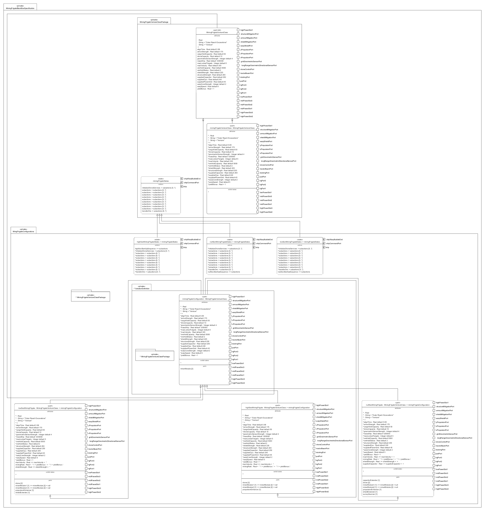

# MiningFrigateBlackBoxSpecification.sysml

## Overview

This SysMLv2 model specifies the black-box definition, configurations, dependencies, and behavioral views for the Venture-class mining frigate. It uses `package`, `part def`, `attribute`, `port`, `state`, `action`, `interface`, `dependency`, and `view def` elements to capture the system-of-interest and its operational context.

## Description

### Mining Frigate Venture Class Package

- **part def MiningFrigateVentureClass**
  - Inherits from `ImperialStandardShip`.
  - Defines manufacturer, vessel type/class, and key attributes (mass, power grid, capacitor, CPU, velocity, warp speed, align time, structure/armor/shield strength, cargo/ore/drone capacity, sensor strength, yield bonus).
  - Specifies ports for power slots, rig slots, pod, docking, tractor beam, drone control, sensors, propulsion, and resilience.
  - Exhibits `miningFrigateStates` for operational behavior, including startup, shutdown, power/grid initialization, scanning, navigation, module/rig extension, warp preparation, drone services, and ore transfer.

- **state miningFrigateStates**
  - Redefines imperial ship states with actions for startup, shutdown, scanning, navigation, module/rig initialization, warp, drone services, and ore transfer.
  - Actions use explicit `in`, `out`, and `send` for command and report flows.

### VariationDefinition Package

- **abstract part miningFrigateConfiguration**
  - Defines module variation points (mining lasers, afterburner).
  - Supports multiple module variants for configuration flexibility.

### MinigFrigateConfigurations Package

- **part highSecMiningFrigate, lowSecMiningFrigate, nullSecMiningFrigate**
  - Each configuration redefines attributes and mounts modules (mining lasers, propulsion enhancers, shield/capacitor extenders, drones, survey scanner).
  - Uses `allocate` to map operational mining rate to pilot pod effectiveness.
  - Defines interfaces for module-to-hull connections (slots, ports).
  - Exhibits configuration-specific states and startup sequences.

### DependenciesToUseCases Package

- **dependency**
  - Traces activities in mining frigate states to corresponding operational use cases, ensuring behavioral alignment and traceability.

### ViewsAndViewDefinitions Package

- **view def 'Mining Frigate Behavior'**
  - Satisfies security concerns and filters state usages.
- **view 'Mining Frigate states'**
  - Exposes state usages for all mining frigate configurations.

## SysMLv2 Compliance

- Uses `part def`, `attribute`, `port`, `state`, `action`, `interface`, and `dependency` for structure and behavior.
- Explicit configuration and allocation for traceability.
- Views support stakeholder concerns and system analysis.

## Purpose

This file provides a comprehensive SysMLv2 specification for the Venture-class mining frigate, supporting requirements traceability, behavioral modeling, and system integration across multiple operational configurations.

## License

This repository is for educational and modeling purposes. See the repository license for details.