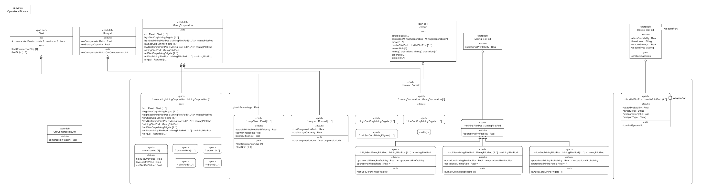

# OperationalDomain.sysml

## Overview

This SysMLv2 model defines the operational domain for mining operations, specifying the structure, relationships, and key attributes of all relevant entities. It uses `package`, `part def`, `part`, `attribute`, `timeslice`, `interface def`, and `view def` elements to capture the domain's composition and behavior.

## Description

### Domain Structure

- **Root Domain (`part def Domain`)**
  - Aggregates all major entities:
    - `pilotPod` (multiple mining pilots)
    - `asteroidBelt` (multiple asteroid belts)
    - `hostilePilotPod` (potential threats)
    - `station` (docking and logistics)
    - `marketHub` (market attributes for ore values)
    - `miningCorporation` (main organization, with buyback policy and mission requirements)
    - `competingMiningCorporation` (other corporations)
    - `drone` (support units)

- **MiningCorporation (`part def MiningCorporation`)**
  - Contains mining frigates for high, low, and null security zones.
  - Defines pilot pods for each security zone, with attributes for mining profitability and mining rate, calculated from ship and pilot skills.
  - Contains a `corpFleet` with timeslices representing operational improvements (e.g., coordination, downtime reduction, survivability, threat response, efficiency, extraction, profitability).
  - Attributes for fleet mining boost, logistics efficiency, and mining mobility.

- **MiningPilotPod (`part def MiningPilotPod`)**
  - Inherits from `PilotPod`.
  - Key measure-of-effectiveness attributes: `operationalProfitability`.
  - Timeslices for tracking improvements in mining rate, cargo capacity, shield strength, threat detection, drone operations, and warp speed.

- **Fleet (`part def Fleet`)**
  - Defines fleet composition, including commander and up to 8 ships.

- **Rorqual (`part def Rorqual`)**
  - Specialized mining ship with ore storage and compression capabilities.

- **HostilePilotPod (`part def HostilePilotPod`)**
  - Inherits from `PilotPod`.
  - Attributes for attack probability, weapon strength, threat level/type, and weapon port.

### Interfaces

- **AsteroidOreIF (`interface def`)**
  - Defines ore transfer between asteroid and ship via ports.

### Views

- **ViewsAndViewsDefinition (`package`)**
  - `view def 'Domain Structure View'`: Satisfies fleet profitability concern and filters part usages.
  - `view 'Mining Frigate structure Table View'`: Exposes pilot pod structure for high sec mining.

## SysMLv2 Compliance

- Uses `part def` for entity definitions and `part` for instantiation.
- Attributes and timeslices model properties and dynamic changes.
- `interface def` and `flow` specify resource exchanges.
- Views and filters support stakeholder concerns and traceability.

## Purpose

This file provides a comprehensive SysMLv2 specification of the mining operational domain, supporting system analysis, requirements traceability, and stakeholder alignment.

## License

This repository is for educational and modeling purposes. See the repository license for details.